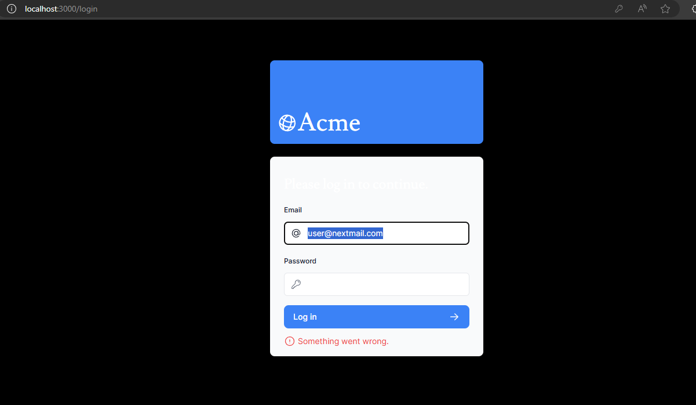

# Laporan Praktikum

| NIM       | Nama                  | Kelas  |
|-----------|-----------------------|--------|
| 214172015 | Vinsensius Ade Winata | TI - 3I|

---

## Problem 1

In this problem, I successfully deployed my project using Vercel. Vercel offers robust infrastructure and rapid deployment capabilities, allowing for easy deployment of Next.js applications. By connecting my GitHub repository to Vercel, any changes made to the main branch automatically trigger redeployment without the need for manual configuration.

## Problem 2

For this problem, I set up an online database on Vercel, utilizing Postgres as a Serverless SQL option. I learned how to configure my project to connect to the database on Vercel by storing private configurations in a `.env` file. It's crucial to ensure that sensitive information is not exposed by including `.env` in the `.gitignore` file.

## Problem 3

In this problem, I seeded data into the database using the command `npm run seed`. This command, defined in the `package.json` file, runs the `node -r dotenv/config ./src/seeder/seed.js` script. While seeding data, I encountered initial setup issues related to dependencies and file paths.

## Problem 4

In this problem, I executed SQL queries to retrieve data from the database. By seeding data into the database, I could perform various queries to analyze and manipulate the data. Additionally, I executed a join operation on the `invoices` and `customers` tables to demonstrate data integration.

## Problem 5

I observed the Vercel project dashboard after pushing changes to my application. Vercel automatically deployed the latest version of my app from the GitHub repository. The dashboard provides insights into the deployment process, allowing me to monitor the status of each deployment.

[Link to deployed application on Vercel](https://vercel.com/vinsensius-ade-winatas-projects/09-nextjs-database/2tb3p8FVxUAbbrmgoD44ksGAwFv8)

## Problem 6

In this problem, I encountered a graph rendering issue related to the revenue chart. The length of the graph was set to 12 months, causing the label for December to overlap with other elements. To resolve this issue, I adjusted the graph length and label placement to ensure proper visualization.

## Problem 7

I encountered an issue with displaying customer photos in the application. Since the photos were stored in the `public` directory, they were not automatically generated when creating a new project. I learned the importance of manually adding images to the `public` directory to ensure they are accessible in the application.

---

### Practicum Assignment

#### No. 1

"If you pay attention to the src\app\page.tsx file for the Card component, it has actually been created as molecules in the src\app\components\molecules\card.tsx file, namely the CardWrapper component. Please adjust it so that it looks like the following image."

  

    Finish!

 

## No.2

"Pay attention to the fetchCardData() function (in the src\model\query.tsx file) from problem number 1. Explain the purpose of the code and the query carried out in this function!"

    This function fetches summary data for a dashboard card from a PostgreSQL database. 
    It executes three SQL queries in parallel to retrieve the count of invoices, count of customers, and total paid and pending amounts of invoices. 

 

  

after inputting username and password from vercel database, its not yet working